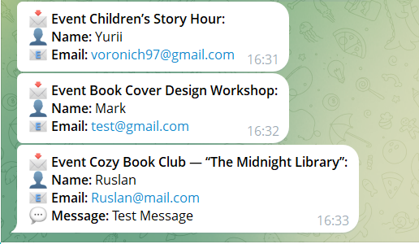
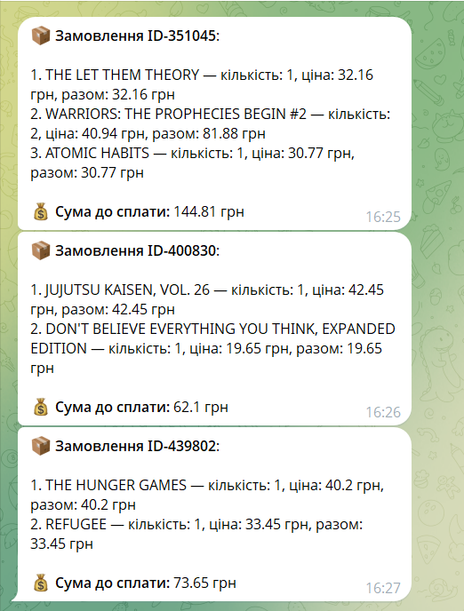
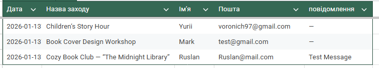
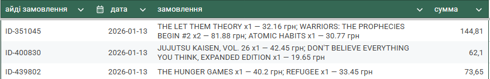

# 📚 Booksy-BackEnd

---

## 🔎 Project Overview

**Type:** SOLO project (additional backend feature for a group project)

This backend handles:

- **Event registrations**
- **Shopping cart submissions**

Upon receiving a request, it:

1. Processes the data
2. Sends it to a **Telegram bot**
3. Records it in **Google Sheets** for real-time request management

Key functionalities:

- Sending messages to Telegram
- Recording data in Google Sheets
- Handling a shopping cart (`cart`)
- Data validation using **celebrate + Joi**
- Simple **REST API** for frontend consumption

---

## 🚀 Technologies

- **Node.js 20+**
- **Express.js**
- **Celebrate + Joi** (validation)
- **Telegram Bot API**
- **Google Sheets API**
- **dotenv**
- **nodemon** (for development)

---

## ⚙️ Setup

1. **Clone the repository**:

```bash
git clone https://github.com/yourusername/Booksy-BackEnd.git
cd Booksy-BackEnd
```

2. **Install dependencies**:

```bash
npm install
```

3. **Create a `.env` file**:

```env
BOT_TOKEN=your_telegram_bot_token
CHAT_ID=your_chat_id
SPREADSHEET_ID=your_google_sheet_id
GOOGLE_CREDENTIALS_PATH=./your_credentials_path.json
```

4. **Start the server**:

```bash
npm run dev
```

---

## 📌 API Endpoints

### POST `/event-registration`

Handles **event registration**.
Sends data to **Telegram** and records it in **Google Sheets**.

**Request Body**

```json
{
  "name": "John Doe",
  "email": "john@example.com",
  "message": "Hello!",
  "dataid": "Book Cover Design Workshop"
}
```

**Notes:**

- `message` is optional; if empty or only spaces, it will **not** be included in the Telegram message.
- `dataid` must be one of the predefined event names.

**Responses**

**200 OK**

```json
{
  "success": true
}
```

**400 Bad Request (validation error)**

```json
{
  "statusCode": 400,
  "error": "Bad Request",
  "message": "Name is required"
}
```

---

### POST `/cart`

Handles **shopping cart submissions**.
Validates cart items, sends formatted order messages to **Telegram**, and records orders in **Google Sheets**.

**Request Body** (array of cart items)

```json
[
  {
    "title": "WARRIORS: THE PROPHECIES BEGIN #2",
    "price": 40.94,
    "qty": 2
  },
  {
    "title": "Another Book",
    "price": 25,
    "qty": 1
  }
]
```

**Validation Rules:**

- `title`: string, 1–255 characters, required
- `price`: positive number, required
- `qty`: integer ≥ 1, required
- The cart must contain **at least one item**

**Processing Steps:**

1. Generates an **order ID**
2. Formats the cart for **Telegram** and sends the message
3. Calculates **order summary** (total price, item breakdown)
4. Records the order in **Google Sheets** (`Лист2`) as: `[orderId, date, summaryText, total]`

**Responses**

**200 OK**

```json
{
  "message": "Order sent successfully",
  "orderId": "abc123def456"
}
```

**400 Bad Request (validation error)**

```json
{
  "statusCode": 400,
  "error": "Bad Request",
  "message": "Cart must contain at least one item"
}
```

---

## 💬 Telegram Integration




---

## 📊 Google Sheets Integration




---

## ⚡ Features

- ✅ Data validation before reaching the controller
- ✅ Telegram bot integration
- ✅ Google Sheets integration
- ✅ Handles optional `message` and optional `cart`
- ✅ Generates **order IDs** and calculates totals

---
